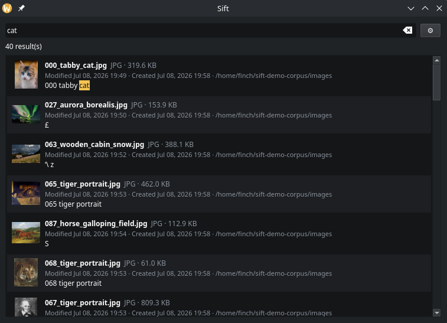
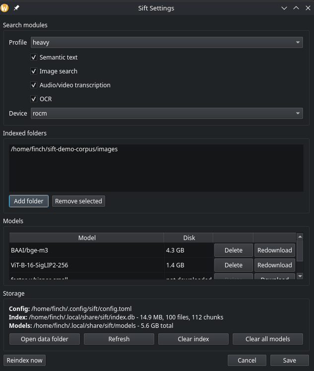
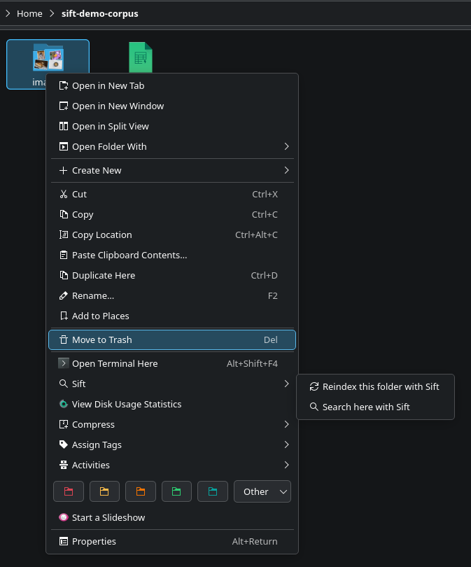

# Sift

[](https://github.com/itstheraj/sift-search/actions/workflows/ci.yml)
[](LICENSE)
[](pyproject.toml)
[](https://github.com/astral-sh/ruff)
[](https://kde.org/plasma-desktop/)
[](#)

Local file search for KDE. Point it at your folders, then search them from the
KDE global search bar, a results window, or Dolphin's right click menu.

Everything runs on your machine. No cloud, no Ollama, no API keys. Content goes
into one SQLite database and comes back out through a mix of full text, fuzzy,
and semantic vector matching.

You can ask it for `budget q3` and get the PDF. You can ask it for
`dog on a beach` and get the photo, even though nothing in the filename says dog
or beach. You can ask it for something a colleague said out loud in a video call
recording and land on the exact second they said it.

Status: early but it works. Text, fuzzy, semantic, images, audio and video
transcripts, and OCR are all functional, and the KDE frontends are in place.

Things it has actually been used for: sorting through building permitting
documentation, and searching a large pile of images and PDFs.

## Demo

Searching a folder of a hundred test photographs.



| Settings | Dolphin |
|---|---|
|  |  |

## Features

- Documents, text, and code: full text plus fuzzy search that survives typos and
  partial words. PDF, DOCX, HTML, Markdown, and the usual plain text and source
  files. Spreadsheets are not read yet, though CSV and TSV are.
- Semantic: matches on meaning, then fuses those results with the keyword hits
  using Reciprocal Rank Fusion.
- Images: describe a picture and find it (SigLIP-2).
- Audio and video: transcribed with timestamps, so a result links to the exact
  second.
- OCR: text inside images and scanned PDFs becomes searchable. Tesseract by
  default, RapidOCR and ONNX optional. Output that does not look like language
  is thrown away, so a photograph of a mountain does not get indexed as `£`.

Pick your folders, pick one of three heaviness profiles (light, medium, heavy)
to decide how much CPU Sift is allowed to spend, and reindex manually or on a
daily timer. It runs at low priority so it stays out of your way. CPU is the
default and a GPU is something you turn on yourself.

## Requirements

- Linux with KDE Plasma 6 for the search bar and Dolphin integration. The CLI
  runs anywhere.
- [uv](https://docs.astral.sh/uv/). The installer provisions an isolated Python
  3.12, so your system Python can be whatever it likes.
- ffmpeg on PATH, for audio and video transcription.
- The tesseract binary, for OCR.

## Install

```bash
./install.sh                   # isolated Python 3.12 + CPU ML stack, writes config
# edit ~/.config/sift/config.toml to add folders, then:
.venv/bin/sift reindex         # build the index
.venv/bin/sift install-kde     # KRunner and Dolphin integration
.venv/bin/sift install-service # daily auto reindex timer
```

`install.sh` writes a default config for you. Folders, profile, modules, and
model storage are all editable from the GUI settings (the gear icon) or straight
from the config file if you prefer a text editor.

Want the smallest possible install? Full text and fuzzy search, no ML
dependencies at all:

```bash
uv venv --python 3.12
uv pip install -e .
sift init
sift reindex ~/Documents
sift search "quarterly budget"
sift status
```

## Optional features

Every capability is a separate extra, switched on by your profile or by a
per feature flag in `~/.config/sift/config.toml`. All of them default to CPU.

```bash
# Semantic text search (bge-m3). Install CPU torch first, or pip drags in CUDA wheels:
uv pip install torch --index-url https://download.pytorch.org/whl/cpu
uv pip install -e ".[semantic]"

# Image search (SigLIP-2)
uv pip install torch torchvision --index-url https://download.pytorch.org/whl/cpu
uv pip install -e ".[image]"

# Audio and video transcription (faster-whisper)
uv pip install -e ".[asr]"

# OCR (Tesseract, needs the tesseract binary). Higher accuracy: ".[ocr-onnx]"
uv pip install -e ".[ocr]"
```

Models download themselves on first use. The defaults (`BAAI/bge-m3`,
`ViT-B-16-SigLIP2-256`, Whisper `small`) are picked so that a CPU only machine
stays usable. Point `[models]` at something bigger for better quality, or set
`device = "auto"` if you want the GPU to do the work.

### GPU

Set `device` under `[resources]`:

| Value | What happens |
|---|---|
| `cpu` | Default. No hardware dependency. |
| `auto` | Use a GPU if torch can see one, otherwise fall back to CPU. |
| `rocm` | AMD. ROCm builds of torch present as a CUDA device, so this is `auto` with the fallback spelled out. |
| `vulkan` | Reserved. Falls back to CPU today. |

This only moves semantic text and image embedding onto the GPU. Transcription
always runs on CPU, because faster-whisper sits on CTranslate2 and CTranslate2
has no ROCm backend. Setting `rocm` will not make Whisper faster, and Sift will
not pretend otherwise.

## Storage and memory

Models land in `~/.local/share/sift/models` the first time you use them. Disk
figures below are measured cache sizes, and a cache can hold more than one weight
format. RAM is approximate for CPU inference and moves around with input size.
You only pay for the features you switch on.

| Capability | Model (default) | Disk | RAM when active |
|------------|-----------------|------|-----------------|
| Semantic text | BAAI/bge-m3 | ~4.3 GB | ~2-3 GB |
| Image | ViT-B-16-SigLIP2-256 | ~1.4 GB | ~2 GB |
| Image (quality) | ViT-SO400M-16-SigLIP2-384 | ~3.5 GB | ~4-5 GB |
| Audio/video | Whisper small (int8) | ~0.5 GB | ~1 GB |
| Audio/video (quality) | Whisper large-v3 (int8) | ~1.5 GB | ~3-4 GB |
| OCR | Tesseract (system tessdata) | ~20 MB | ~0.3 GB |
| OCR (onnx) | RapidOCR | ~15 MB | ~0.3 GB |

A few notes:

- The CPU PyTorch runtime costs roughly 1 GB on disk, shared between the semantic
  and image features.
- `sift paths` and the GUI settings report exact, deduplicated cache sizes. The
  HuggingFace cache hardlinks its blobs, so measuring the directory naively
  counts the same bytes twice.
- The `light` profile needs no models at all and a few hundred MB of RAM.
- The index is one SQLite file under `~/.local/share/sift`. It grows with how
  much text and how many embeddings you throw at it.
- `sift paths` will tell you the real number any time, as will the GUI settings.

## KDE integration

```bash
uv pip install -e ".[gui,kde]"
sift install-kde
kquitapp6 krunner
```

- **KRunner** (Alt+Space): type and Sift results show up in the global search
  bar. Fast full text and fuzzy, transcripts and image filenames included.
- **Search window**: `sift gui`, or the "Sift Search" application entry. Full
  hybrid search. Click a result to open it, and media opens at its timestamp
  through mpv.
- **Dolphin**: right click a folder for "Search here with Sift" and "Reindex
  this folder".

## Reindexing

- By hand: `sift reindex`, or Dolphin's "Reindex this folder".
- Daily: `sift install-service` installs a throttled systemd user timer.
- Indexing is incremental. Unchanged files are skipped, and the whole thing runs
  at low CPU and IO priority.

## Benchmarks

`sift bench` measures throughput and, more importantly, whether Sift is ruining
your desktop. While a full reindex runs it probes real file operations and
compares idle latency against latency under load.

A run on a Ryzen 7 7800X3D, light profile, 800 documents:

```
Indexed         : 800 docs / 2.0 MB
Reindex time    : 0.62 s
Throughput      : 1286 docs/s | 3.1 MB/s
Query latency   : p50 1.07 ms | p95 1.96 ms (50 queries)
Peak RSS        : 25 MB

File-op latency   p50 (ms)    p95 (ms)
 idle baseline       0.023       0.040
 under reindex       0.028       0.052
p95 slowdown      : 1.30x (target < 1.5x)
```

Image indexing on the same box, with an RX 9070 XT and `device = "rocm"`: 100
photographs embedded with `ViT-B-16-SigLIP2-256` in 10.4 seconds wall clock,
model load included. Queries like `underwater` and `the night sky` then return
the right photographs, none of which have any of those words in the filename.

Run it yourself. The numbers on your machine are the only ones that matter.

## Configuration

`~/.config/sift/config.toml` holds the profile, folders, excludes, models, and
resource limits. The profiles are `light` (text only), `medium` (adds semantic
and image), and `heavy` (adds transcription and OCR). Anything a profile decides
for you can be overridden one capability at a time under `[features]`.

### Ranking

Keyword, fuzzy, and vector results are fused with Reciprocal Rank Fusion, over
files rather than over chunks. RRF assumes every list ranks the same set of
things, and the text and image vector indexes hold different chunks, so fusing
at the chunk level means they can never agree on anything. Files are the set
they share. Each list votes through the best chunk it found for a file, so a
document you match by keyword in one paragraph and by meaning in another adds
those signals together instead of throwing one away. A file votes at most once
per list, so one long document cannot crowd everything else off the page.

Ties are broken in favour of a keyword match and then by chunk id, so results
never depend on the order in which the modalities were consulted.

`[search] text_min_similarity` and `image_min_similarity` can drop weak vector
candidates before fusion. Both ship at `0.0`, meaning off. On `bge-m3` a
meaningless match reaches a cosine of `0.544` while a loosely worded but
genuinely relevant one can sit at `0.545`, so there is no cutoff that separates
them, and a badly chosen one silently deletes real results. Raise it only for a
corpus you know well.

## Scripting

`sift search --json` prints results as JSON, which makes Sift easy to wire into
scripts, editors, or anything else that would rather parse than squint:

```bash
sift search "quarterly budget" --json --limit 5
sift search "invoice" --json --path ~/Documents/2026
```

## Contributing

See [CONTRIBUTING.md](CONTRIBUTING.md). The test suite uses fake embedders and
transcribers, so it runs in seconds and needs no models and no GPU.

Security issues go through [SECURITY.md](SECURITY.md), not the issue tracker.

## License

MIT. See [LICENSE](LICENSE).
